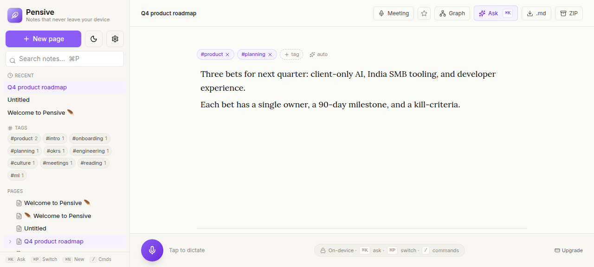
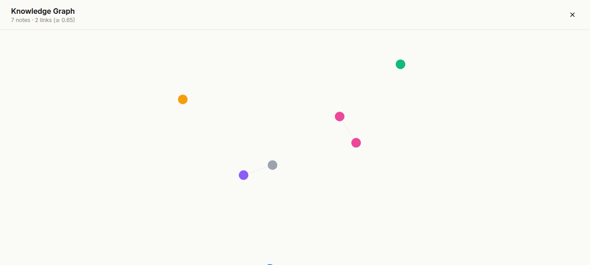
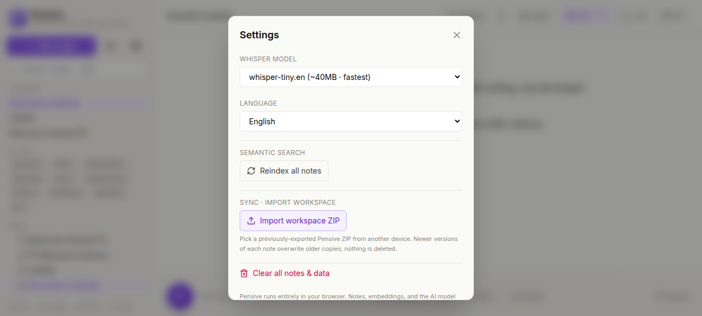

# 🪶 Pensive

> **Notes that never leave your device.**

[](https://github.com/shrestha-tripathi/pensive/actions)
[](LICENSE)
[](https://github.com/shrestha-tripathi/pensive/stargazers)
[](https://worksoffline.in)
[](#-privacy)

A **local-first**, fully offline note-taking app with on-device AI. Speak into it (Whisper). Chat with your notes (RAG + Qwen2.5 via WebGPU). Organize them in nested pages. Sync between devices with a portable ZIP — **no servers, no accounts, no telemetry**.

🔗 **Live demo:** https://shrestha-tripathi.github.io/pensive/

<p align="center">
  
  <br/>
  <sub><i>Open a note → edit → knowledge graph → import/export ZIP — all running locally in the browser.</i></sub>
</p>

---

## ⏱️ 30-second value prop

You want Notion's structure, Obsidian's privacy, Mem.ai's intelligence, and Reflect's polish — without sending your thoughts to anyone's servers, without paying $10/month, without a desktop install.

Pensive is a **single React app** that runs entirely in your browser. Whisper transcribes your voice on-device. A bge-small embedding model indexes every note. Qwen2.5 chats with that index over WebGPU. Your data lives in IndexedDB and stays there. Move it between devices with an exportable ZIP.

Free, MIT-licensed, and shipping today.

---

## 🆚 How it compares

| Feature | **Pensive** | Notion | Obsidian | Mem.ai | Reflect |
|---|:---:|:---:|:---:|:---:|:---:|
| 100% local data | ✅ | ❌ | ✅ | ❌ | ❌ |
| Works offline | ✅ | ⚠️ | ✅ | ❌ | ⚠️ |
| Zero install (browser) | ✅ | ✅ | ❌ | ✅ | ✅ |
| On-device voice transcription | ✅ | ❌ | ❌ | ❌ | ❌ |
| On-device RAG chat | ✅ | ❌ | ⚠️ plugin | ✅ cloud | ✅ cloud |
| Nested pages | ✅ | ✅ | ⚠️ | ❌ | ❌ |
| Backlinks & mentions | ✅ | ✅ | ✅ | ✅ | ✅ |
| Knowledge graph | ✅ | ❌ | ✅ | ❌ | ❌ |
| Quick switcher | ✅ | ✅ | ✅ | ✅ | ✅ |
| Portable ZIP export + import | ✅ | ⚠️ md only | ⚠️ vault | ❌ | ❌ |
| Zero telemetry | ✅ | ❌ | ✅ | ❌ | ❌ |
| Open source | ✅ MIT | ❌ | ⚠️ partial | ❌ | ❌ |
| Free tier fully featured | ✅ | ⚠️ | ✅ | ❌ | ❌ |

---

## 📸 Screenshots

| Editor + sidebar + related notes | Knowledge graph |
|:---:|:---:|
|  |  |
| Tiptap editor with auto-tags, semantic related-notes panel, and nested pages tree. | Force-directed graph of every note, edges weighted by embedding similarity (≥ 0.65). |

| Settings — sync, reindex, capacity | |
|:---:|:---:|
|  | _Manual cross-device sync via portable ZIP — newer notes win, nothing is deleted._ |

> **Want to contribute screenshots from your own setup?** Drop them into `docs/screenshots/` and open a PR.

---

## ✨ Feature tour

- **Editor**: Tiptap (ProseMirror) — slash menu, headings, lists, tasks, tables, code blocks, callouts, toggles, mentions, image attachments (drag-drop / paste).
- **🎙️ Voice**: one-shot dictation **and** Meeting Mode (long-form, chunked transcription with auto-summary into TLDR / Decisions / Action Items).
- **🧠 RAG chat (⌘K)**: ask questions across every note, streamed answers with citations, all on-device (Qwen2.5-1.5B via WebLLM).
- **🔍 Hybrid search**: BM25 + bge-small embeddings; quick switcher (⌘P) for keyboard-first navigation.
- **🕸️ Knowledge graph**: force-directed view of semantic links between notes, click-to-jump.
- **🏷️ Auto-tags + backlinks**: every note gets suggested tags from a topic vocab + embedding model; `@mentions` create wikilinks both ways.
- **📦 Portable workspace**: export the entire workspace as a ZIP (markdown files + lossless `pensive.json` manifest). **Import on another device** — newer-`updatedAt` wins per note ID, nothing is deleted, safe to round-trip.
- **🛡️ Capability-aware**: WebGPU is probed; falls back to WASM transparently. Mic / Meeting buttons disable with a tooltip on browsers that lack secure-context audio capture.
- **📱 Mobile-friendly**: hamburger drawer, swipe-friendly UI, PWA installable.
- **🌗 Themes**: light/dark, no flash of wrong theme on load.
- **🔒 Service worker**: COOP/COEP injection (so SharedArrayBuffer works on GitHub Pages) + offline cache.

---

## 🛠️ Tech stack

| Layer | Tool |
|---|---|
| Build | **Vite 5** |
| UI | **React 18 + TypeScript + Tailwind v4** |
| Editor | **Tiptap (ProseMirror)** |
| Voice | **Whisper via @huggingface/transformers** (WASM/WebGPU) |
| Embeddings | **bge-small-en-v1.5** (Transformers.js, mean-pooled, L2-normalized) |
| Chat LLM | **Qwen2.5 via @mlc-ai/web-llm** (WebGPU) |
| Storage | **IndexedDB** (`idb`) — notes, embeddings, attachments |
| Search | Hybrid: BM25 + cosine over local vector index |
| Graph | `react-force-graph-2d` (lazy-loaded chunk) |
| Packaging | `jszip` for export/import, COI service worker for cross-origin isolation |
| Hosting | GitHub Pages (static), no backend |

---

## 🚀 Quick start

```bash
git clone https://github.com/shrestha-tripathi/pensive.git
cd pensive
npm install --legacy-peer-deps
npm run dev      # http://localhost:5173
npm run build    # production build → dist/
npm run preview  # preview the production build
```

> **WebGPU recommended** for the chat feature (Chrome/Edge 113+ on a desktop GPU). Everything else — voice, embeddings, graph — gracefully falls back to WASM on any modern browser.

### Cross-device sync (manual, no server)

1. On device A: header → **ZIP** → save the file (e.g. AirDrop / iCloud / Drive / USB to device B).
2. On device B: **Settings → Import workspace ZIP** → pick the file.
3. Newer versions of each note overwrite older copies; local-only notes are preserved. Embeddings reindex automatically in the background.

The exported ZIP contains:
- A folder tree of human-readable `.md` files (one per note, mirroring the page hierarchy).
- `pensive.json` — lossless manifest used on import to restore IDs, parents, tags, timestamps, and rich Tiptap formatting.
- `README.txt` — reminder of how to import.

---

## 🗺️ Roadmap & Changelog

### v1.5 — Sync, sturdiness & sane fallbacks _(current)_
- 📦 **Workspace ZIP import** — pick a previously-exported ZIP from any device. Conflict policy: `updatedAt`-newer-wins per note ID, never deletes local-only notes.
- 📦 Export now writes a lossless `pensive.json` manifest alongside the markdown tree (full Tiptap JSON, IDs, parents, tags, timestamps).
- 🛡️ **Real WebGPU capability probe** — `requestAdapter()` is now actually awaited (was just checking `navigator.gpu` which exists on Windows Chrome even when no adapter is available). Voice, Meeting, embeddings, and reindex now always succeed via WASM fallback.
- 🎙️ Mic + Meeting buttons disable with a tooltip when audio capture is unavailable (insecure context, missing MediaRecorder, etc.).
- 🕸️ **Hardened Graph view** — chunk-load retry + error UI, proper empty-state with a one-click "Index all notes now" button if no embeddings exist yet.
- 🛡️ **Hardened COI service worker** — fetch errors no longer cascade into `Failed to convert value to 'Response'`, which was silently breaking lazy chunk loads (graph, transformers).

### v1.4 — Final v1 ship _(shipped)_
- 🎙️ **Meeting Mode** — long-form recording with chunked Whisper transcription + AI summary (TLDR / Decisions / Action Items) inserted into the active note.
- 💳 Pricing modal wired into the footer (Free / Pro waitlist / Self-host tiers).
- 🌐 OG + Twitter card meta tags for rich link previews.

### v1.3 — Mobile + media _(shipped)_
- 📱 Responsive mobile drawer (hamburger toggle, backdrop, swipe-friendly).
- 🖼️ Image attachments via drag-drop / paste (stored as data URLs in IndexedDB).

### v1.2 — Knowledge & polish _(shipped)_
- 🕸️ Force-directed knowledge graph view (lazy-loaded).
- 🏷️ Auto-tagging from note content (topic vocab + embeddings).
- 🔗 Related-notes sidebar (vector similarity).
- 📦 Workspace ZIP export (preserves nested-page hierarchy).

### v1.1 — AI everywhere _(shipped)_
- ✨ Slash-menu AI commands: Continue, Summarize (callout), Improve selection.
- 💬 RAG chat (⌘K) with streaming citations.
- ⚡ PWA install + offline service-worker cache.

### v1.0 — Local-first foundations _(shipped)_
- Tiptap editor with slash menu, mentions, nested pages, tasks, tables, code blocks.
- IndexedDB persistence + sample onboarding note.
- 🎤 Whisper voice capture (one-shot transcription).
- 🧠 bge-small embedding index for semantic search.
- ⌘P quick switcher, dark mode, MD export.
- Backlinks & `@mention` linking.

### v2+ — What's next
- E2E-encrypted optional sync (server cannot decrypt).
- Templates & daily notes.
- Plugin SDK.
- Whisper-large + Llama-3 model upgrades.

---

## 🔐 Privacy

- **Zero telemetry.** No analytics, no error reporting, no pings.
- **Zero servers.** There is no backend. The "deploy" is `dist/` on GitHub Pages.
- **Zero accounts.** No sign-up, no login.
- **Your data lives in IndexedDB** under your browser's origin. Clear browser data → clear Pensive.
- **All AI runs on-device.** Whisper, bge, and Qwen2.5 are downloaded once and cached.
- **Sync is manual and offline.** The export ZIP never touches a server you don't control — move it via AirDrop, USB, your own cloud drive, whatever.
- **Open source under MIT.** Audit every line.

If we ever add automatic sync, it will be **end-to-end encrypted** with a key that never leaves your browser. We physically cannot read your notes.

---

## 🤝 Contributing

Issues and PRs welcome. Run `npm run build` before opening a PR — TypeScript must pass. Screenshots/GIFs improving the README are very welcome too — drop into `docs/screenshots/` and reference them in the relevant section.

---

## 📄 License

MIT — do whatever you want, just keep the notice.

---

<p align="center">
  Made with 🪶 in 🇮🇳 by <a href="https://github.com/shrestha-tripathi">@shrestha-tripathi</a><br/>
  Part of <a href="https://worksoffline.in"><b>worksoffline.in</b></a> — the home of browser-only, privacy-first tools.
</p>
